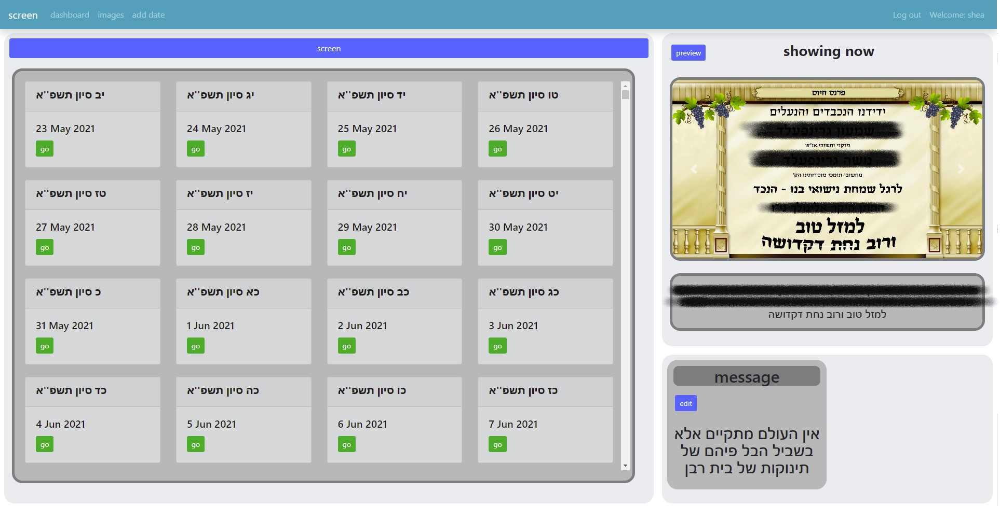

# calendar-screen
this project is a hebrew calendar 📅 that will display sponsers for the specified dates.
the technologies I used are: python/django and bootstrap.
Please don't see this project as the way or cleanness I write code, just to see my familiarity with the technologies I used.

